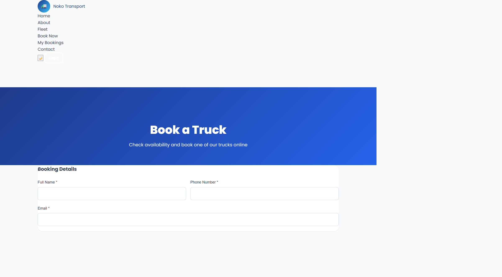
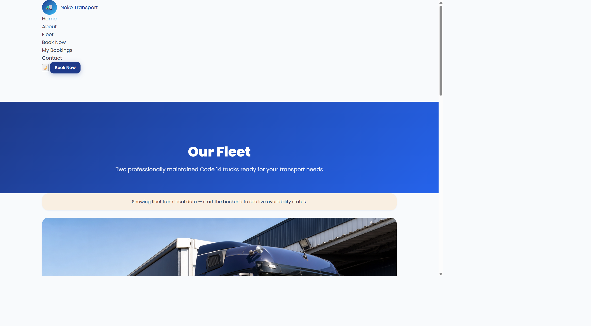
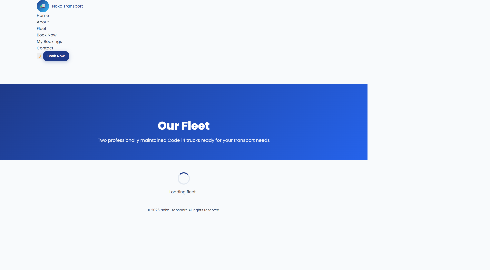
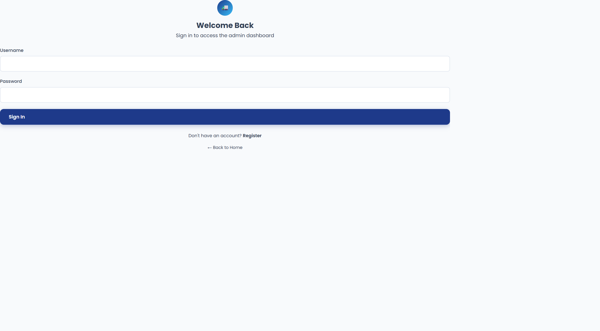
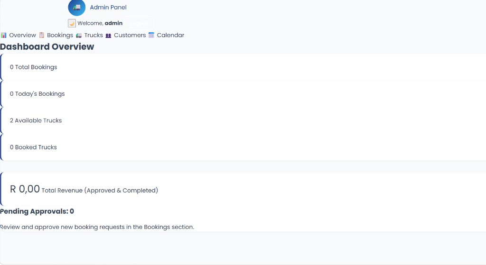

<h1 align="center">Noko Transport — Truck Booking System</h1>

<p align="center">
  A full-stack web application for managing Code 14 truck rentals — built with Spring Boot, MySQL, and vanilla JavaScript.
</p>

<p align="center">
  
  
  
  
  
</p>

---

## Overview

Noko Transport is a truck booking platform where customers browse the fleet, check real-time availability, and place bookings online. Administrators manage bookings, trucks, and customers through a secure dashboard.

This project demonstrates end-to-end software development — REST API design, database modelling, authentication, business logic, and a responsive frontend.

## Screenshots

<table>
  <tr>
    <td align="center" width="50%">
      
      <br /><sub><b>Home</b> — Landing page with services and fleet preview</sub>
    </td>
    <td align="center" width="50%">
      
      <br /><sub><b>Fleet</b> — Truck listings with availability status</sub>
    </td>
  </tr>
  <tr>
    <td align="center" width="50%">
      
      <br /><sub><b>Booking</b> — Online form with interactive availability calendar</sub>
    </td>
    <td align="center" width="50%">
      
      <br /><sub><b>Admin Login</b> — JWT-secured authentication</sub>
    </td>
  </tr>
  <tr>
    <td align="center" colspan="2">
      
      <br /><sub><b>Admin Dashboard</b> — Booking stats, revenue tracking, and fleet overview</sub>
    </td>
  </tr>
</table>

## Key Features

**Customer-facing**
- Interactive availability calendar (available, booked, pending)
- Online booking with validation and unique booking references
- Customer registration, login, and booking history
- PDF booking confirmation download
- Responsive layout with dark mode

**Admin**
- Dashboard with booking stats and revenue overview
- Approve, reject, edit, and cancel bookings
- Fleet and customer management
- Calendar view and date-based booking filters

## Tech Stack

| Layer | Technologies |
|-------|-------------|
| Frontend | HTML5, CSS3, JavaScript (ES6) |
| Backend | Java 17, Spring Boot 3.2, Spring Security, Spring Data JPA |
| Database | MySQL 8 |
| Auth | JWT (JSON Web Tokens) |
| Build | Maven Wrapper |

## Skills Demonstrated

- Full-stack architecture with a decoupled REST API and static frontend
- JWT authentication with role-based access control (Admin / Customer)
- Business logic — overlap detection, truck suggestions, scheduled booking expiry
- Database design with JPA/Hibernate and MySQL
- Production-minded config — environment variables, gitignored secrets, Maven Wrapper

## Getting Started

**Requirements:** Java 17+, MySQL 8+

```bash
# 1. Clone the repository
git clone https://github.com/Advo6/truck-booking-system.git
cd truck-booking-system

# 2. Configure the database
cp backend/src/main/resources/application.example.properties backend/src/main/resources/application.properties
# Edit application.properties with your MySQL credentials

# 3. Start the backend
cd backend
./mvnw spring-boot:run        # macOS / Linux
.\mvnw.cmd spring-boot:run      # Windows (PowerShell)

# 4. Start the frontend (new terminal)
cd frontend
python -m http.server 5500
```

Open **http://localhost:5500**

**Demo admin login:** `admin` / `admin123`

## Project Structure

```
truck-booking-system/
├── frontend/     # Static HTML/CSS/JS client
├── backend/      # Spring Boot REST API
├── database/     # MySQL schema
└── docs/         # Screenshots and documentation
```

## License

MIT
